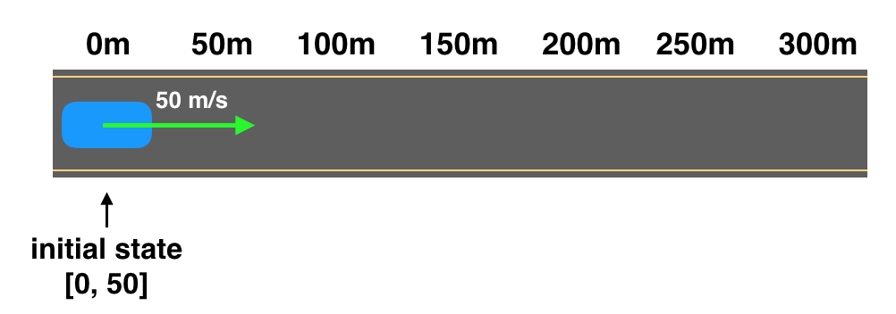

# Computer-vision-predict-state-of-car
Computer-vision-predict-state-of-car-using motion model

## What is State?
When you localize a car, you’re interested in only the car’s position and it’s movement.

This is often called the state of the car.

The state of any system is a set of values that we care about.
In the cases we’ve been working with, the state of the car includes the car’s current **position, x, ** and its velocity, v.

In code this looks something like this:


```x = 4
vel = 1

state = [x, vel]
```

### Predicting Future States:

The state gives us most of the information we need to form predictions about a car’s future location. And in this lesson, we’ll see how to represent state and how it changes over time.

For example, say that our world is a one-lane road, and we know that the current position of our car is at the start of this road, at the 0m mark. We also know the car’s velocity: it’s moving forward at a rate of 50m/s. These values are it’s initial state.

```state = [0, 50]
```


<br/><br/>

### Predicting State:
Let’s look at the last example.

The initial state of the car is at the 0m position,and it's moving forward at a velocity of 50 m/s.
Let’s assume that our car keeps moving forward at a constant rate.

Every second it moves 50m.

So, after three seconds, it will have reached the 150m mark and its velocity will not have changed (that's what a constant velocity means)!


<br/><br/>

### Motion Model:

This is a reasonable prediction, and we made it using:

The initial state of the car and
An assumption that the car is moving at a constant velocity.
This assumption is based on the physics equation:
```distance_traveled = velocity * time


```

This equation is also referred to as a motion model. And there are many ways to model motion!

<br/>

This motion model assumes constant velocity.

In our example, we were moving at a constant velocity of 50m/s for three seconds.

And we formed our new position estimate with the distance equation: 150m = 50m/sec*3sec.


